# CShell  Linux网络编程大作业

## 介绍
这是咱的网络编程大作业
基于Select的群聊和Telnet控制

## 软件架构
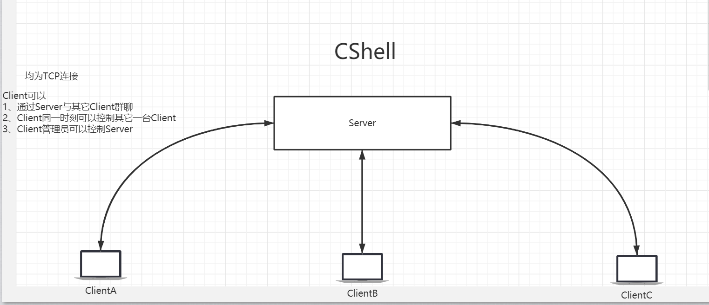

## 文件
> 源文件
- Server.c
- Client.c

<br><br><br><br><br><br><br><br><br><br><br><br><br><br><br><br><br><br><br><br><br><br><br><br><br>

## 编译
- `gcc -std=c99 Server.c -o Server`
- `gcc -std=c99 Client.c -o Client`

<br><br><br><br><br><br><br><br><br><br><br><br><br><br><br><br><br><br><br><br><br><br><br><br><br>

## 使用说明
### 启动
1. 启动服务端
`./Server [IPV4] [ListenPort]`

Example  

``` 
./Server 100.2.169.8 9190
```
<!-- 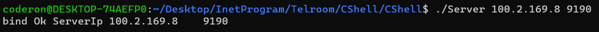 -->

<center>
    
    <br>
    <div style="color:orange; border-bottom: 1px solid #d9d9d9;
    display: inline-block;
    color: #999;
    padding: 2px;">开启服务端</div>
</center>

2. 开启客户端 
`./Client [IPV4] [Port] [YourName] `

Example 
```
./Client 100.2.169.8 9190 锦龙
```

<!-- 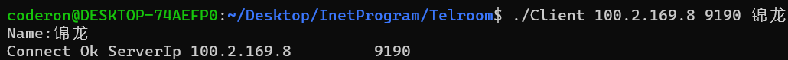 -->

<center>
    
    <br>
    <div style="color:orange; border-bottom: 1px solid #d9d9d9;
    display: inline-block;
    color: #999;
    padding: 2px;">客户端连接</div>
</center>

<br><br><br><br><br><br><br><br><br><br><br><br><br><br><br><br><br><br><br><br><br><br><br><br><br>

### 群聊功能
> 在此之前，再打开一个客户端，重复之前操作即可

直接键入消息，摁下回车，即默认为发送聊天信息

<!-- 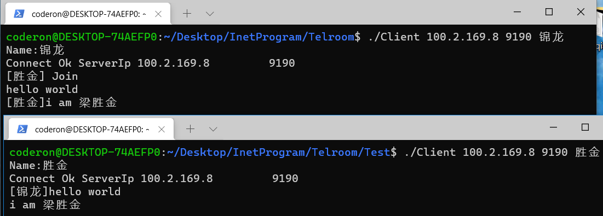 -->

<center>
    
    <br>
    <div style="color:orange; border-bottom: 1px solid #d9d9d9;
    display: inline-block;
    color: #999;
    padding: 2px;">聊天功能</div>
</center>

<br><br><br><br><br><br><br><br><br><br><br><br><br><br><br><br><br><br><br><br><br><br><br><br><br>

### telnet远程控制功能
#### `$`使用

`$` 代表服务端要处理的命令
```
格式    $[Command]
```
| 前缀        | 命令         |作用|
| ----------- | ----------- |----------|
| `$`         | `ls`        |列出已经连接服务端的客户端详情|

---
Example
`$ls`

可以知道客户端这些信息 iP地址、端口号、SockNum(套接字号)、名字

<!--  -->

<center>
    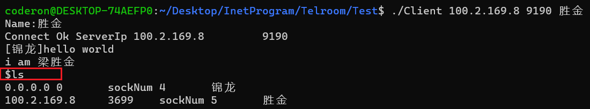
    <br>
    <div style="color:orange; border-bottom: 1px solid #d9d9d9;
    display: inline-block;
    color: #999;
    padding: 2px;">$ls功能展示</div>
</center>

> 不必在意为啥第一个地址是 `0.0.0.0 0`,我试了很多次，每次第一个地址都是0，大概因为我是在本机测试的。请放心，该程序已经在局域网的多台机器上测试过。

<br><br><br><br><br><br><br><br><br><br><br><br><br><br><br><br><br><br><br><br><br><br><br><br><br>

#### `:`使用
> `:`代表远程客户端要执行的命令

1. 指定要连接的客户端

用法 `:telnet [sockNum] [password]`

Example
```
:telnet 4 password
```

注意:`4` 是`$ls`中获取的，`password`是密码

<!-- 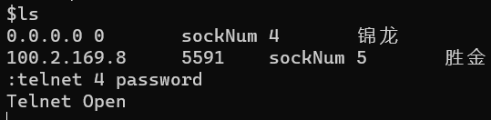 -->

<center>
    
    <br>
    <div style="color:orange; border-bottom: 1px solid #d9d9d9;
    display: inline-block;
    color: #999;
    padding: 2px;">telnetOpen</div>
</center>

2. 开始控制远程客户端

> 需要注意一点，执行这些命令大部分都要加一个后缀 `> cmd.txt`  

<br><br><br><br><br><br><br><br><br><br><br><br><br><br><br><br><br><br><br><br><br><br><br><br><br>

- Linux下常用的命令

Example
```
:pwd > cmd.txt
```
<!-- 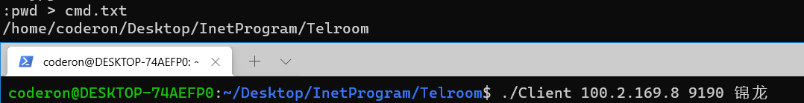 -->

<center>
    
    <br>
    <div style="color:orange; border-bottom: 1px solid #d9d9d9;
    display: inline-block;
    color: #999;
    padding: 2px;">pwd展示</div>
</center>

Example
```
:ls > cmd.txt
```
<!-- 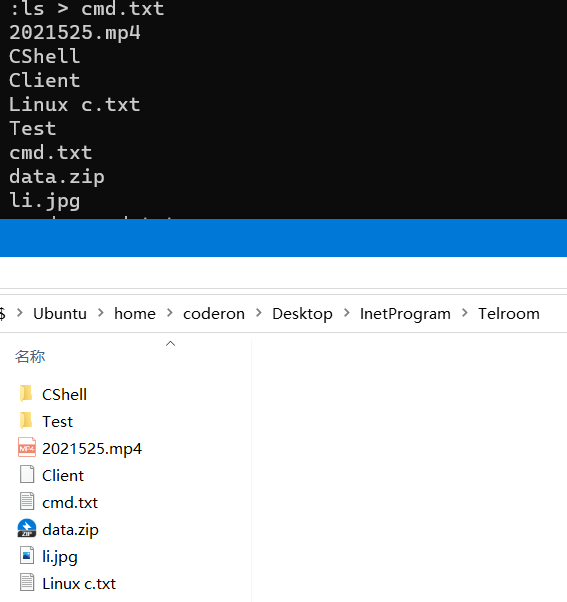 -->
<center>
    
    <br>
    <div style="color:orange; border-bottom: 1px solid #d9d9d9;
    display: inline-block;
    color: #999;
    padding: 2px;">:ls的返回与真实目录对比</div>
</center>


<br><br><br><br><br><br><br><br><br><br><br><br><br><br><br><br><br><br><br><br><br><br><br><br><br>


- 自定义的命令

| 前缀          | 命令        |使用        |  作用        |
| ----------- | ----------- |----------|---------------|
| `:`  | `fetch`|`:fetch [filename]`|获取远程客户端的文件|
|`:`    |`push`|`:push [filename]`|将本地的文件发送给远程客户端|

Example
```
:fetch li.jpg
```
可以自己对比两个文件，看一下是否一样。
<!-- 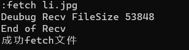 -->
<center>
    
    <br>
    <div style="color:orange; border-bottom: 1px solid #d9d9d9;
    display: inline-block;
    color: #999;
    padding: 2px;">fetch</div>
</center>

Example
```
:push fetch.png
```
> 把当前目录下的fetch.png发送出去，当然也可以指定路径。
<!-- 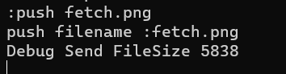 -->

<center>
    
    <br>
    <div style="color:orange; border-bottom: 1px solid #d9d9d9;
    display: inline-block;
    color: #999;
    padding: 2px;">push</div>
</center>

<br><br><br><br><br><br><br><br><br><br><br><br><br><br><br><br><br><br><br><br><br><br><br><br><br>

--- 
- 我测试过的一些Linux常用命令,以Centos 为例

| 前缀 | 命令     |作用      | 后缀|
| -----| --------|----------|-----|
|`:`   | `reboot`|重启|      `> cmd.txt`|
|`:`   |`shutdown -P`| 关机|`> cmd.txt`|
|`:`   |`ps -A `|显示所有进程信息|`> cmd.txt`|
|`:`   |`ps -ef`|显示所有进程信息，包括命令的绝对路径|`> cmd.txt`|
|`:`   |`kill [pid]`|杀死对应进程号的进程|`> cmd.txt`|
|`:`   |`kill -9 [pid]`|强制杀死对应进程号的进程|`> cmd.txt`|
|`:`   |`yum install -y cowsay`|安装cowsay,一款命令行软件|`> cmd.txt`|
|`:`   |`cowsay [内容]`|亲测，比较好玩|`> cmd.txt`|
|`:`   |`cowsay -l`|列出其它动物|`> cmd.txt`|
|`:`   |`cowsay -f [-l列出的动物名] [内容]`|选择一种|`> cmd.txt`|


--- 
<br><br><br><br><br><br><br><br><br><br><br><br><br><br><br><br><br><br><br><br><br><br><br><br><br>
# 其它
看完前面,大致上你可以知道软件是如何使用了，下面我说一说原理和遇到的难题，以及可以做一些有趣的事情。有兴趣的可以接着看。


### 问题

1. 为什么要加前缀？
2. 为什么要加后缀？
3. 客户端是如何执行命令的？
4. Select的客户端使用，解决键盘输入和接收服务端信息问题
5. Server的Select使用
5. 处理各种字符串问题，解析字符串

###  回答
1. 前缀，当然是为了区分服务端命令、客户端命令、普通群聊消息。好让服务器以此转发。
2. 后缀，本质上是为了存储命令行的执行结果
5. 有些函数可以执行系统级的命令，如`system(char * command)`。如果有输出，我就将结果保存到`cmd.txt`上，使用重定向符 `> cmd.txt`。
4. Select客户端
<!-- 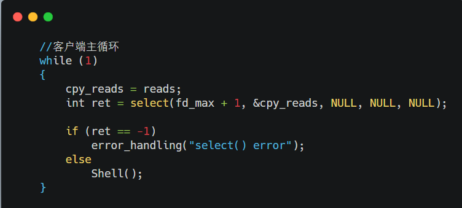 -->

<center>
    
    <br>
    <div style="color:orange; border-bottom: 1px solid #d9d9d9;
    display: inline-block;
    color: #999;
    padding: 2px;">Select客户端的大循环</div>
</center>

<!-- 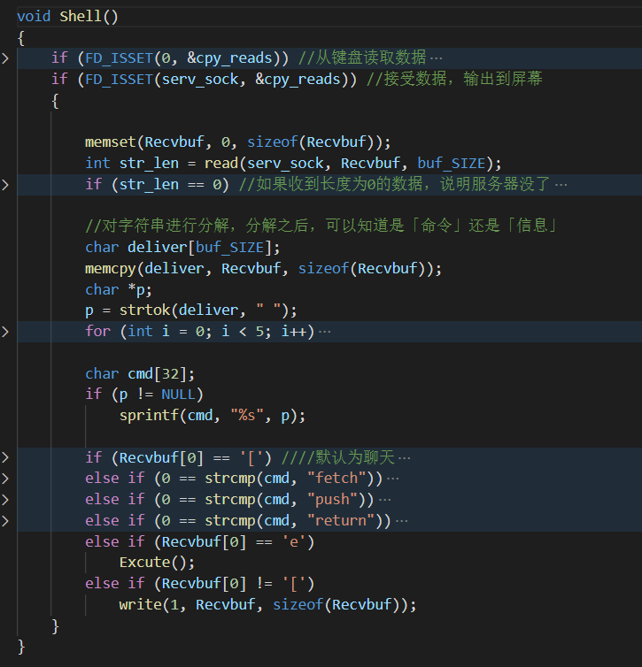 -->

<center>
    
    <br>
    <div style="color:orange; border-bottom: 1px solid #d9d9d9;
    display: inline-block;
    color: #999;
    padding: 2px;">Shell内部简介</div>
</center>

5. Server的Select使用
<!-- 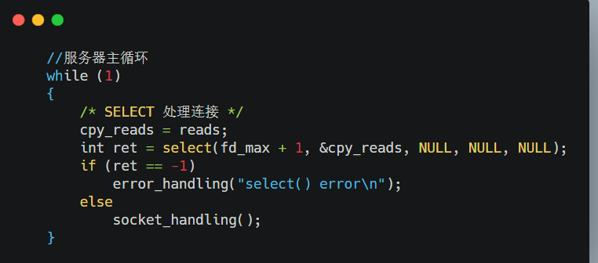 -->

<center>
    
    <br>
    <div style="color:orange; border-bottom: 1px solid #d9d9d9;
    display: inline-block;
    color: #999;
    padding: 2px;">Server的Select使用</div>
</center>

<!-- 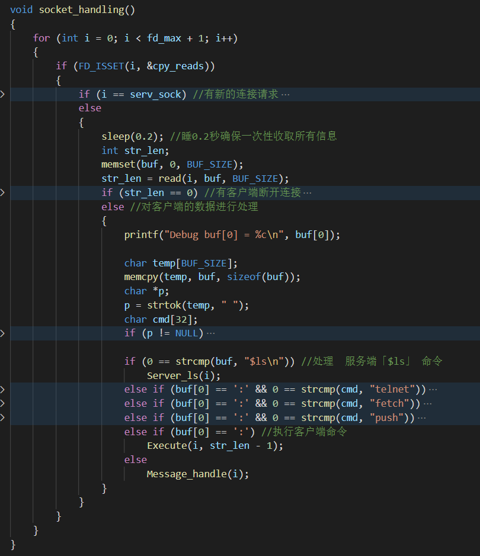 -->

<center>
    
    <br>
    <div style="color:orange; border-bottom: 1px solid #d9d9d9;
    display: inline-block;
    color: #999;
    padding: 2px;">socket_handling</div>
</center>

